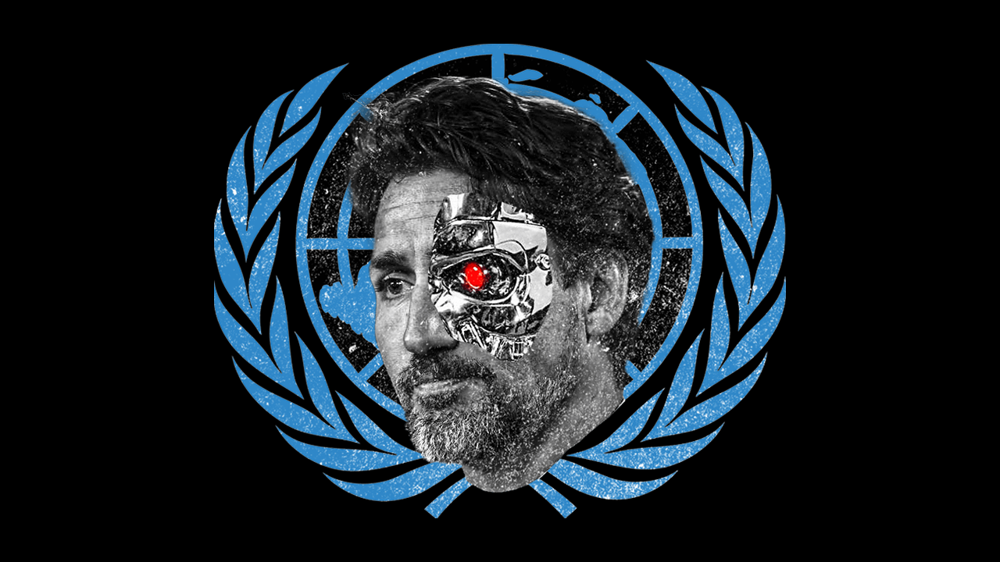
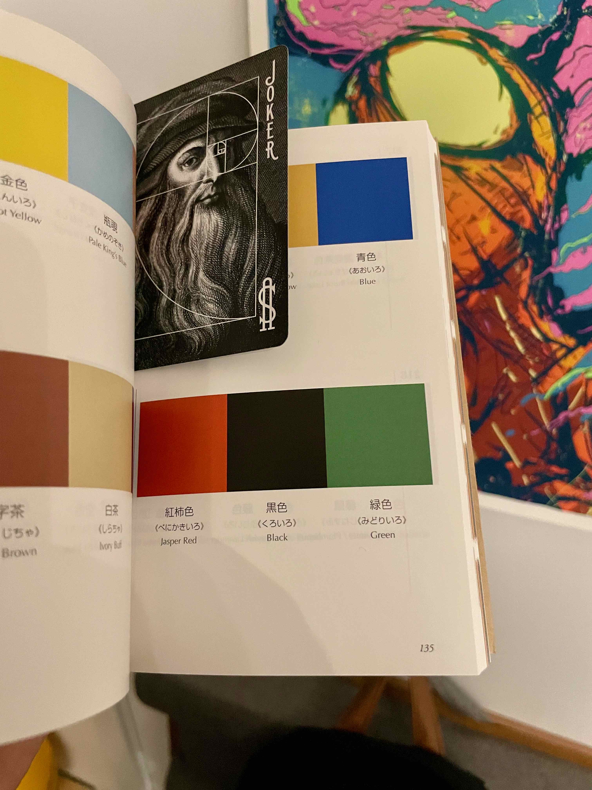
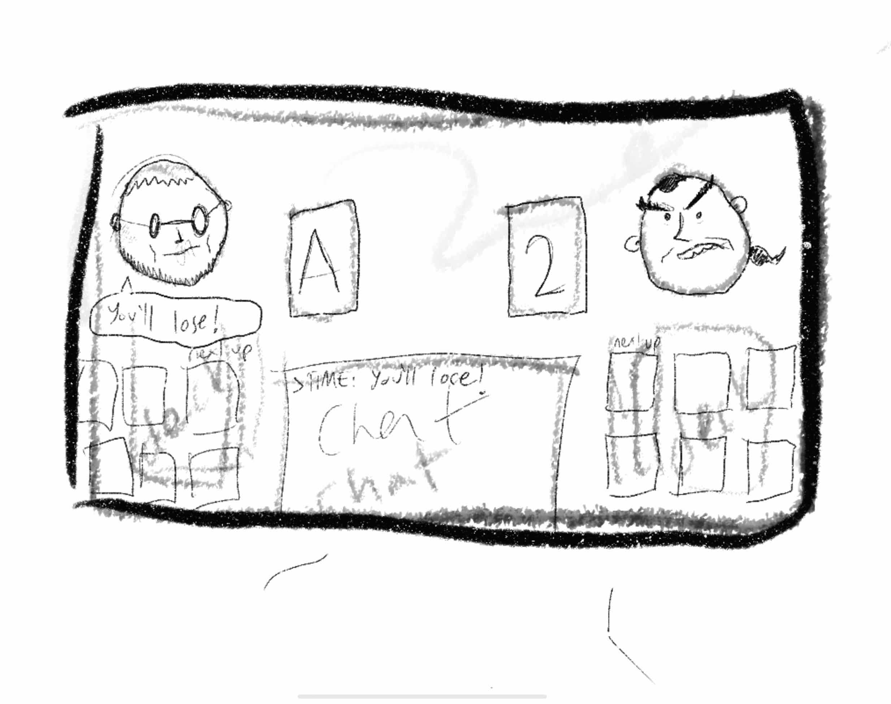

# WARG8

## Index

- [WARG8](#warg8)
  - [Index](#index)
  - [Description](#description)
  - [Tech](#tech)
  - [Third-Party Libraries](#third-party-libraries)
  - [To Run Locally](#to-run-locally)
  - [To Deploy](#to-deploy)
  - [Images from the process](#images-from-the-process)
    - [Choosing the colors](#choosing-the-colors)
    - [Ideation](#ideation)

## Description

WARG8 alive at [https://war.emre.la](https://war.emre.la)

I'm a product designer turned to self-taught front-end developer.

I designed and developed this app in around 7 days for [Mintbean Hiring Hackathon for Jr Web Devs](https://mintbean.io/meets/7e2331fb-1e0d-4b31-86b9-a46acad877af).

See my portfolio at -> [https://emre.la](https://emre.la)

## Tech

ReactJS, TypeScript, TailwindCSS, Firebase, Adobe Photoshop, Procreate

## Third-Party Libraries

React, Router, Lodash, DayJS, UUID, React, Icons

## To Run Locally

- Download the repo
- Open the terminal, cd into the folder.
- `npm install`
- `npm start`

## To Deploy

I deployed the app to Firebase automagically, deploy wherever you want but don't forget to `npm run build` first.

## Images from the process

Let's see how the sausage is made.

### Choosing the colors

These were (Jasper Red, Black, Green) the original colors I was going to go with, until I noticed that there isn't enough time to perfect the design. Plus the CMYK values depicting the selected colors didn't look as great on the screen.

### Ideation

I used Procreate to sketch the Game/Deck/Chat components. What you will see is quite ambitious. That's why I wasn't able to do it due to time restrictions. I planned to have "Doom Guy"-esque damage states, chat messages, etc. Maybe next time!

